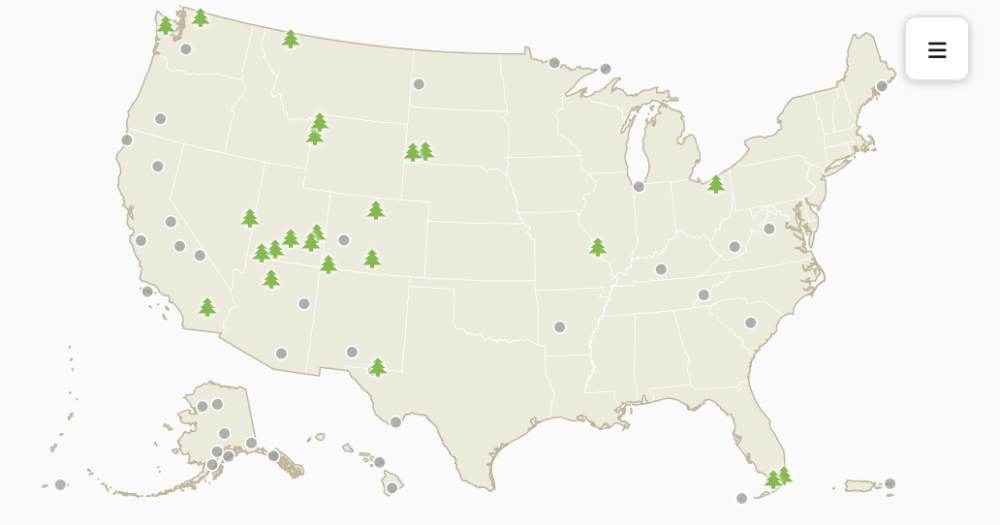
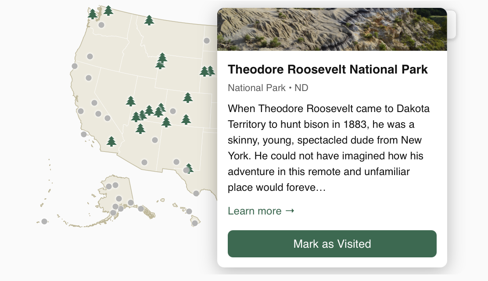

# NPS Parks Card

A custom Lovelace card for Home Assistant that renders an interactive map of
US National Park Service sites — including Puerto Rico/USVI, Guam/N. Mariana
Islands, and American Samoa — and tracks which ones you've visited.


This card is the companion Lovelace card for
[**ha-nps-parks**](https://github.com/FCjosh/ha-nps-parks), the Home
Assistant integration that pulls park data from the NPS API and gives you
one entity per site to track. You'll need that integration installed first
— this repo is the map/UI layer only.

## Screenshots






## Features

- Full US map (mainland, Alaska, Hawaii, and territories) drawn as vector
  paths via D3's composite Albers projection — no map tiles, no Leaflet, no
  external tile service or API key required.
- Each tracked park renders as a marker colored by visited/unvisited state,
  either a plain dot or an [MDI icon](https://pictogrammers.com/library/mdi/)
  of your choosing.
- Click a marker for a popup with the park's photo, designation, description,
  and a button to toggle its visited state.
- A searchable slide-in panel lists every tracked park.
- Card height is derived automatically from whatever width Lovelace gives it
  — no manual sizing required.
- Fully themeable: follows Home Assistant's light/dark mode automatically
  (or pin it explicitly), with three built-in color presets (classic, slate,
  sepia) and every map color — background, land, borders, coastline —
  independently overridable per theme.
- Visual editor for every option below, including live color swatches — no
  YAML required.

## Requirements

- Home Assistant with [ha-nps-parks](https://github.com/FCjosh/ha-nps-parks)
  installed and configured.

## Installation

1. Install and configure [ha-nps-parks](https://github.com/FCjosh/ha-nps-parks)
   first — see its README for setup.

### This card, via HACS (recommended)

2. In HACS, go to **Frontend** → the **⋮** menu → **Custom repositories**.
3. Add this repository's URL, category **Dashboard**.
4. Install **NPS Parks Card**, then hard-refresh your browser.

### This card, manually

2. Copy `nps-parks-card.js` into your `config/www/` folder.
3. Add it as a dashboard resource: **Settings → Dashboards → ⋮ → Resources**,
   URL `/local/nps-parks-card.js`, type **JavaScript Module**.
4. Hard-refresh your browser. If you update the file later and don't see the
   change, bump the URL with a version query string (e.g.
   `/local/nps-parks-card.js?v=2`) — browsers cache JS resources aggressively.

## Usage

Add the card via the dashboard UI (search for "NPS Parks Card"), or in YAML:

```yaml
type: custom:nps-parks-card
```

No configuration is required.

## Configuration options

The easiest way to configure the card is the visual editor — add it via the
dashboard UI and click **Edit**; every option below is exposed there,
including live color swatches. Everything is also settable directly in
YAML. All options are optional; defaults are shown below.

```yaml
type: custom:nps-parks-card

# Theme
theme_mode: auto        # 'auto' (follows HA's light/dark mode) | 'light' | 'dark'
color_preset: classic   # 'classic' | 'slate' | 'sepia' — starting point for the map colors below
show_background: true   # false = fully transparent card, no shadow either

# Map colors — seeded from color_preset, override any of them individually
light_background_color: '#c9d8e8'   # ocean/water fill, light mode
light_land_color: '#ede9dc'         # state/territory fill, light mode
light_border_color: '#ffffff'       # state border stroke, light mode
light_coastline_color: '#c0b898'    # national coastline + territory border, light mode
dark_background_color: '#0f172a'
dark_land_color: '#2c3440'
dark_border_color: '#161b22'
dark_coastline_color: '#4a5568'

# Marker colors and opacity
visited_color: '#2D6A4F'
unvisited_color: '#9a9a9a'
visited_opacity: 1.0
unvisited_opacity: 0.75

# Marker size (px) — independent per state, since icons vary in visual weight
visited_marker_size: 12
unvisited_marker_size: 12

# Optional MDI icon per state. Leave unset (null) for a plain colored dot.
# Visited and unvisited are independent — mix and match freely, e.g. an
# icon for visited parks and a dot for unvisited ones.
visited_icon: mdi:pine-tree
unvisited_icon: null
```

The color values above are the `classic` preset's defaults — switching
`color_preset` to `slate` or `sepia` changes the effective default for any
of the eight `*_color` options you haven't explicitly set yourself.

### Example: alternate color preset

```yaml
type: custom:nps-parks-card
color_preset: sepia
```

### Example: icon markers for both states

```yaml
type: custom:nps-parks-card
unvisited_icon: mdi:map-marker-outline
visited_marker_size: 18
unvisited_marker_size: 10
```

### Example: transparent card

```yaml
type: custom:nps-parks-card
show_background: false
```

## Development
 
The card is bundled from source with [esbuild](https://esbuild.github.io/) —
`dist/nps-parks-card.js` (what actually ships and what HACS installs) is a
generated file, not hand-edited directly.
 
```bash
git clone https://github.com/FCjosh/lovelace-nps-parks-card.git
cd nps-parks-card
npm install
```
 
Edit `src/nps-parks-card.js`, then:
 
```bash
npm run build          # one-off build
npm run watch          # rebuilds on every save
```
 
Commit both your `src/` change and the resulting `dist/nps-parks-card.js`
together.
 
`d3-geo` is pinned to `^2.0.1` — `geo-albers-usa-territories` declares that
as a peer dependency, and installing `d3-geo@3.x` alongside it fails with an
`ERESOLVE` conflict rather than warning. Don't bump it to a 3.x major
version without confirming compatibility first.

## Known limitations

- Territories with widely separated park units (e.g. American Samoa's
  Tutuila, Ofu, and Ta'u) are supported, but a park unit far outside all
  five covered regions (mainland, AK, HI, PR/USVI, Guam/N. Marianas,
  American Samoa) won't have anywhere to render and will be silently
  skipped.

## License

MIT