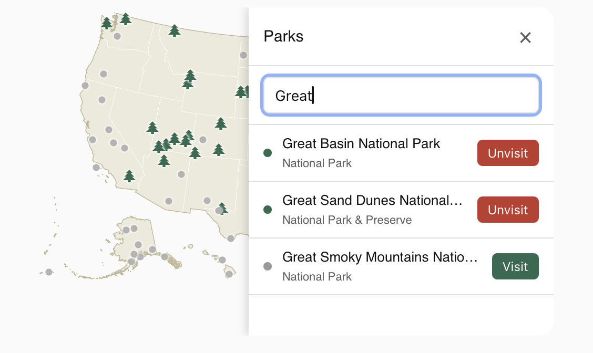

# NPS Parks Card

A custom Lovelace card for Home Assistant that renders an interactive map of
US National Park Service sites — including Puerto Rico/USVI, Guam/N. Mariana
Islands, and American Samoa — and tracks which ones you've visited.


This card is the companion Lovelace card for
[**ha-nps-parks**](https://github.com/FCjosh/ha-nps-parks), the Home
Assistant integration that pulls park data from the NPS API and gives you
one entity per site to track. You'll need that integration installed first
— this repo is the map/UI layer only.

## Screenshots




## Features

- Full US map (mainland, Alaska, Hawaii, and territories) drawn as vector
  paths via D3's composite Albers projection — no map tiles, no Leaflet, no
  external tile service or API key required.
- Each tracked park renders as a marker colored by visited/unvisited state,
  either a plain dot or an [MDI icon](https://pictogrammers.com/library/mdi/)
  of your choosing.
- Click a marker for a popup with the park's photo, designation, description,
  and a button to toggle its visited state.
- A searchable slide-in panel lists every tracked park.
- Card height is derived automatically from whatever width Lovelace gives it
  — no manual sizing required.
- Fully themeable: reads Home Assistant's theme variables for text/background
  colors, and supports a fully transparent background.

## Requirements

- Home Assistant with [ha-nps-parks](https://github.com/FCjosh/ha-nps-parks)
  installed and configured.

## Installation

1. Install and configure [ha-nps-parks](https://github.com/FCjosh/ha-nps-parks)
   first — see its README for setup.

### This card, via HACS (recommended)

2. In HACS, go to **Frontend** → the **⋮** menu → **Custom repositories**.
3. Add this repository's URL, category **Lovelace**.
4. Install **NPS Parks Card**, then hard-refresh your browser.

### This card, manually

2. Copy `nps-parks-card.js` into your `config/www/` folder.
3. Add it as a dashboard resource: **Settings → Dashboards → ⋮ → Resources**,
   URL `/local/nps-parks-card.js`, type **JavaScript Module**.
4. Hard-refresh your browser. If you update the file later and don't see the
   change, bump the URL with a version query string (e.g.
   `/local/nps-parks-card.js?v=2`) — browsers cache JS resources aggressively.

## Usage

Add the card via the dashboard UI (search for "NPS Parks Card"), or in YAML:

```yaml
type: custom:nps-parks-card
```

No configuration is required.

## Configuration options

All options are optional; defaults are shown below.

```yaml
type: custom:nps-parks-card

# Marker colors and opacity
visited_color: '#2D6A4F'
unvisited_color: '#9a9a9a'
visited_opacity: 1.0
unvisited_opacity: 0.75

# Marker size (px) — independent per state, since icons vary in visual weight
visited_marker_size: 12
unvisited_marker_size: 12

# Optional MDI icon per state (e.g. 'mdi:pine-tree'). Leave unset for a
# plain colored dot. Visited and unvisited are independent — mix and match
# freely, e.g. an icon for visited parks and a dot for unvisited ones.
visited_icon: null
unvisited_icon: null

# Card background (the "ocean")
background_color: '#c9d8e8'
show_background: true   # false = fully transparent card, no shadow either
```

### Example: icon markers

```yaml
type: custom:nps-parks-card
visited_icon: mdi:pine-tree
visited_marker_size: 18
unvisited_marker_size: 10
```

### Example: transparent card

```yaml
type: custom:nps-parks-card
show_background: false
```

## Known limitations

- Territories with widely separated park units (e.g. American Samoa's
  Tutuila, Ofu, and Ta'u) are supported, but a park unit far outside all
  five covered regions (mainland, AK, HI, PR/USVI, Guam/N. Marianas,
  American Samoa) won't have anywhere to render and will be silently
  skipped.

## License

MIT